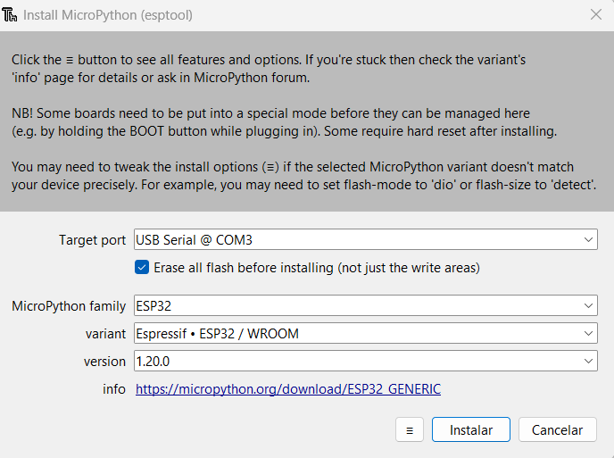

# DualMCU ESP32: MicroPython

Este repositorio contiene un ejemplo básico de cómo instalar MicroPython en la DualMCU utilizando el microcontrolador ESP32. El objetivo principal es que encuentres este repositorio útil y puedas incorporar partes de esta implementación en tus proyectos.

## Configuración del entorno 👋
Antes de comenzar, se recomienda realizar la siguiente configuración:

> *Instalación de Thonny*: 
> Esto te permitirá descargar el firmware en la DualMCU ESP32.

Dirígete a *"Ejecutar"* -> *"Configurar intérprete"*  para completar la configuración.

 

### Actualización de firmware 
Para poder utilizar MicroPython, es recomendable considerar la actualización. Por lo tanto, es necesario iniciar tu DualMCU ESP32 presionando el botón de FLASH.


1. Da clic en "Instalar o Actualizar MicroPython".

1. Se abrirá una nueva ventana. 
    - Se recomienda utilizar la siguiente configuración: 
        - Variant: Espessif ESP32/WROOM
        - Version: 1.20.0

1. Presionar instalar (esperar a que termine la instalacion).


Estos pasos te permitirán actualizar y configurar MicroPython de manera adecuada en tu DualMCU ESP32.

## 🛠️ Abrir y ejecutar 
Una vez que hayas configurado el entorno, puedes abrir y ejecutar el ejemplo.

Dentro de la carpeta Ejemplos, encontrarás un ejemplo básico llamado "blink" que puedes utilizar para verificar que la configuración se aplicó correctamente.

```python
'''
Unit Electronics 2023
       (o_
(o_    //\
(/)_   V_/_ 

version: 0.0.1
revision: 0.0.1
context: This code is a basic configuration of three RGB Led's
'''
import machine
import time

led_pin = machine.Pin(4, machine.Pin.OUT)
led_pin2 = machine.Pin(26, machine.Pin.OUT)
led_pin3 = machine.Pin(25, machine.Pin.OUT)


def loop():
     while True:
        led_pin.on()    
        led_pin2.on()   
        led_pin3.on()  
        time.sleep(1)  
        led_pin.off()   
        led_pin2.off()  
        led_pin3.off()  
        time.sleep(1)   

loop()
```


## Proyecto en funcionamiento
Una vez que hayas realizado todas las configuraciones y conexiones necesarias, podrás ver el proyecto en funcionamiento.


## Expande tu conocimiento 

Para que continues aprendiendo, se te recomienda visitar el repositorio completo referente a la [DualMCU](https://github.com/UNIT-Electronics/DualMCU).


## DualMCU ESP32+RP2040 

Para obtener más información, consulte las páginas del producto en

* https://uelectronics.com/
* [Hardware-DualMCU](https://github.com/UNIT-Electronics/DualMCU/tree/main/Hardware)
* [Product Reference Manual.pdf](https://github.com/UNIT-Electronics/DualMCU/blob/main/DualMCU(Product%20Reference%20Manual).pdf)
* [C++ & Micropython Examples files for the UNIT DualMCU.](https://github.com/UNIT-Electronics/DualMCU/tree/main/Examples)


---
⌨️ con ❤️ por [UNIT-Electronics](https://github.com/UNIT-Electronics) 😊